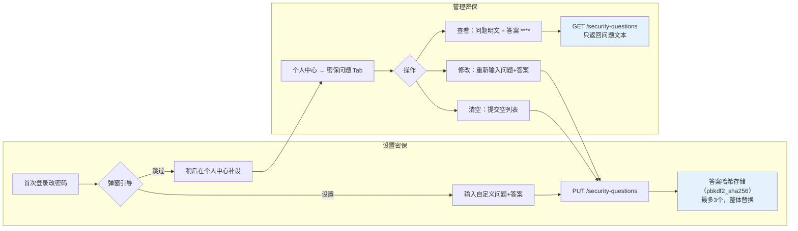

# 忘记密码密保验证 — 功能流程图

## 一、总体架构

```
┌──────────────────────────────────────────────────────────────┐
│                      忘记密码流程                              │
│                                                              │
│   学生端                    教师/管理员端                      │
│   ──────                    ────────────                      │
│   [登录页]                                          [学生管理页]│
│      │                                                    │  │
│      ├── 自助重置（密保验证）                               │  │
│      │    └── 答对 → 重置密码 ←──┐                          │  │
│      │                          │                          │  │
│      ├── 人工申请                │                          │  │
│      │    └── 留言 → 待审批 ──→ 审批通过 → 生成临时密码 ───┘  │
│      │                    └──→ 驳回 → 学生被通知              │
│      │                                                      │
│      └── 密保设置引导                                        │
│           ├── 首次改密后弹出                                  │
│           └── 个人中心随时管理                                │
└──────────────────────────────────────────────────────────────┘
```

## 二、忘记密码自助重置流程

```mermaid
flowchart TD
    A[学生点击"忘记密码？"] --> B[输入学号]
    B --> C{GET /password/forgot/questions}
    C --> D{用户是否存在?}
    D -- 否 --> E["提示：学号不存在"]
    D -- 是 --> F{是否设置了密保问题?}
    F -- 否 --> G[进入人工申请流程]
    F -- 是 --> H[显示密保问题列表]
    H --> I[学生填写答案 + 新密码]
    I --> J{检查失败次数}
    J -- "已超限(≥5次/5分钟)" --> K["提示：验证次数超限\n弹窗引导转人工重置"]
    K --> G
    J -- 未超限 --> L[记录一次失败尝试]
    L --> M{验证全部答案}
    M -- 全部正确 --> N[清除失败计数]
    N --> O[重置密码]
    O --> P["提示：密码重置成功\n请用新密码登录"]
    M -- 有错误 --> Q{剩余次数?}
    Q -- "> 0" --> R["提示：答案错误\n（剩余 N 次尝试）"]
    R --> I
    Q -- "= 0" --> K

    style A fill:#e8f5e9
    style P fill:#c8e6c9
    style K fill:#ffcdd2
    style E fill:#ffcdd2
```

## 三、人工审批重置流程

```mermaid
flowchart TD
    subgraph 学生端
        A[进入人工申请] --> B[填写申请说明]
        B --> C[POST /password/forgot/request]
        C --> D{是否已有 pending 申请?}
        D -- 是 --> E["提示：已有待处理申请\n请耐心等待"]
        D -- 否 --> F["提交成功\n提示：请等待教师或管理员审核"]
    end

    subgraph 教师端
        G[教师打开"密码重置管理"] --> H{选择状态筛选}
        H --> I[待处理列表]
        I --> J{审批操作}
        J --> K[审批通过]
        J --> L[驳回]
        K --> M[生成8位随机临时密码]
        M --> N[重置学生密码\n标记 needs_password_change=true]
        N --> O[弹窗显示临时密码\n支持一键复制]
        L --> P[填写驳回原因]
        P --> Q["状态变更为 rejected"]
    end

    subgraph 管理员端
        R[管理员打开"密码重置"] --> S{选择状态筛选}
        S --> T[待处理列表]
        T --> U{审批操作}
        U --> V[审批通过/驳回\n（同教师端）]
    end

    F --> I
    F --> T

    style F fill:#c8e6c9
    style O fill:#c8e6c9
    style Q fill:#ffcdd2
```

## 四、密保问题生命周期



## 五、防暴力破解机制

```mermaid
flowchart TD
    A[学生提交密保答案] --> B{检查内存计数器}
    B --> C["_FORGOT_FAILURES[user_id]\n=[(time1, time2, ...)]"]
    C --> D[清理 5 分钟前的记录]
    D --> E{记录数 >= 5?}
    E -- 是 --> F["返回 429\n验证次数超限\n请等待5分钟或申请人工重置"]
    E -- 否 --> G[追加当前时间戳]
    G --> H{验证答案}
    H -- 正确 --> I["清除 _FORGOT_FAILURES[user_id]\n正常重置密码"]
    H -- 错误 --> J["返回错误 + 剩余次数\n(5 - 当前记录数)"]

    F --> K[前端弹窗："是否转人工重置？"]
    K -- 确认 --> L[跳转到人工申请表单]
    K -- 取消 --> M[关闭弹窗，等待解锁]

    style F fill:#ffcdd2
    style I fill:#c8e6c9
    style J fill:#fff9c4
```

## 六、API 接口清单

| 序号 | 方法 | 路径 | 权限 | 说明 |
|:---:|------|------|:---:|------|
| 1 | GET | `/api/security-questions` | 登录态 | 获取我的密保问题（只返回问题文本） |
| 2 | PUT | `/api/security-questions` | 登录态 | 设置密保问题（整体替换，最多3个） |
| 3 | GET | `/api/password/forgot/questions?user_id=xxx` | 公开 | 获取指定用户的密保问题（仅问题文本） |
| 4 | POST | `/api/password/forgot/reset` | 公开 | 提交答案验证并重置密码 |
| 5 | POST | `/api/password/forgot/request` | 公开 | 提交人工密码重置申请 |
| 6 | GET | `/api/teacher/password-reset-requests` | teacher | 教师查看本班学生重置申请 |
| 7 | POST | `/api/teacher/password-reset-requests/{id}/approve` | teacher | 教师审批通过 |
| 8 | POST | `/api/teacher/password-reset-requests/{id}/reject` | teacher | 教师驳回 |
| 9 | GET | `/api/admin/password-reset-requests` | admin | 管理员查看全部重置申请 |
| 10 | POST | `/api/admin/password-reset-requests/{id}/approve` | admin | 管理员审批通过 |
| 11 | POST | `/api/admin/password-reset-requests/{id}/reject` | admin | 管理员驳回 |

## 七、数据库表结构

### security_questions（密保问题）

| 字段 | 类型 | 说明 |
|------|------|------|
| id | INTEGER PK | 自增主键 |
| user_id | VARCHAR(32) FK → users.id | 所属用户 |
| question | VARCHAR(200) | 自定义密保问题 |
| answer_hash | VARCHAR(255) | 答案哈希（pbkdf2_sha256） |
| created_at | DATETIME | 创建时间 |

### password_reset_requests（密码重置申请）

| 字段 | 类型 | 说明 |
|------|------|------|
| id | INTEGER PK | 自增主键 |
| user_id | VARCHAR(32) FK → users.id | 申请人 |
| message | TEXT | 申请留言 |
| status | VARCHAR(20) | pending / approved / rejected |
| resolved_by | VARCHAR(32) FK → users.id | 审批人 |
| new_password_hash | VARCHAR(255) | 审批后新密码哈希 |
| temp_password | VARCHAR(32) | 临时密码明文（供后续查看） |
| resolved_at | DATETIME | 审批时间 |
| created_at | DATETIME | 申请时间 |

## 八、安全设计要点

| 维度 | 措施 |
|------|------|
| 答案存储 | pbkdf2_sha256 哈希，不可逆，与原密码哈希方案一致 |
| 暴力破解 | 同一 user_id 5 分钟内最多 5 次错误，超限返回 429 并锁定 |
| API 暴露 | 忘密接口只返回问题文本，绝不返回答哈希 |
| 临时密码 | 审批后生成随机 8 位，`needs_password_change=true` 强制首次登录改密 |
| 教师权限 | 只能审批本班学生申请（通过 StudentClassEnrollment 关联校验） |
| 管理员权限 | 可审批所有申请 |
| 操作日志 | 重置/审批/驳回均记录 logger.info |
| 旧接口兜底 | `POST /api/password/forgot` 保留兼容（标记为已废弃） |

## 九、前端页面关系

```
LoginView.vue (登录页)
  └── 忘记密码弹窗（三步流程）
       ├── Step 1: 输入学号 → 查询密保问题
       ├── Step 2: 回答密保问题 + 新密码 → 自助重置
       └── Step 3: 留言 → 提交人工申请

ChangePasswordView.vue (首次改密)
  └── 改密成功 → 弹出密保设置引导（可跳过）

ProfileView.vue (个人中心)
  └── 密保问题 Tab → 查看/编辑/清空

TeacherStudentAdmin.vue (教师-学生管理)
  └── 密码重置管理卡片
       ├── 状态筛选：待处理 / 已通过 / 已驳回
       ├── 操作：审批通过（生成临时密码）/ 驳回
       └── 历史：临时密码查看 + 复制

AdminPasswordReset.vue (管理员-密码重置)
  └── 同等功能（查看全部申请）
```
